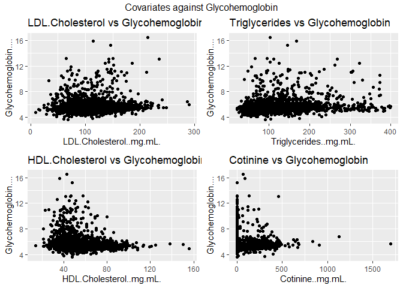
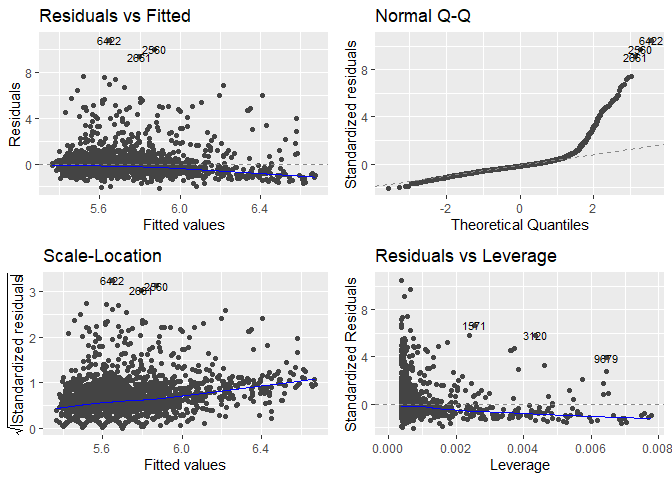

*Exercise started at 10AM and finished at 2:30PM (London time)*

*Solved using R markdown*

## Introduction
We are investigating a clinical dataset to look for associations between a diagnostic marker of diabetes, glycohemoglobin and other biomarkers. The aim is to assess a hypothesis of a doctor that certain lab tests are predictive of others, in our case of the level of glycohemoglobin.


## Question 0
We start by loading the data.


```r
glycohemoglobin = read.csv("glycohemoglobin.csv")
cotinine = read.csv("cotinine.csv")
lipid = read.csv("lipid.csv")
demographics = read.csv("demographics.csv")
```


## Question 1

#### Structure of the datasets
We then take a quick look at the structure of each dataset by using the **str** function.


```r
str(glycohemoglobin)
```

```
## 'data.frame':	9756 obs. of  2 variables:
##  $ ID                 : int  62161 62162 62163 62164 62165 62166 62167 62168 62169 62170 ...
##  $ Glycohemoglobin....: num  5.1 NA 5.5 4.9 5.9 NA NA NA 5.4 5.2 ...
```

```r
str(cotinine)
```

```
## 'data.frame':	9756 obs. of  2 variables:
##  $ ID              : int  62161 62162 62163 62164 62165 62166 62167 62168 62169 62170 ...
##  $ Cotinine..mg.mL.: num  0.011 NA 0.019 0.011 0.046 NA NA 0.011 0.037 0.011 ...
```

```r
str(lipid)
```

```
## 'data.frame':	9756 obs. of  4 variables:
##  $ ID                     : int  62161 62162 62163 62164 62165 62166 62167 62168 62169 62170 ...
##  $ Triglycerides..mg.mL.  : int  84 NA NA 56 71 NA NA NA 78 44 ...
##  $ LDL.Cholesterol..mg.mL.: int  110 NA NA 151 84 NA NA NA 73 77 ...
##  $ HDL.Cholesterol..mg.mL.: int  41 NA 44 28 63 NA NA 51 43 61 ...
```

```r
str(demographics)
```

```
## 'data.frame':	9756 obs. of  5 variables:
##  $ ID                                                           : int  62161 62162 62163 62164 62165 62166 62167 62168 62169 62170 ...
##  $ age                                                          : int  22 3 14 44 14 9 0 6 21 15 ...
##  $ race..1.Mexican..2.Other.Hispanic..3.White..4.Black..5.Other.: int  3 1 5 3 4 3 5 5 5 5 ...
##  $ Income.Poverty.Ratio                                         : num  3.15 0.6 4.07 1.67 0.57 NA NA 3.48 0.33 5 ...
##  $ Sex..1.Male..2.Female.                                       : int  1 2 1 2 2 1 1 1 1 1 ...
```

#### Merging the datasets
Each dataset has a column "ID" which identifies a unique patient. The identifiers are the same accross all datasets. As such, we combine all the datasets by patient "ID". We then once again use the **str** function to ensure the combined dataset was properly created. 


```r
data=Reduce(function(x,y) full_join(x,y,by="ID"), list(glycohemoglobin,cotinine,lipid,demographics))
str(data)
```

```
## 'data.frame':	9756 obs. of  10 variables:
##  $ ID                                                           : int  62161 62162 62163 62164 62165 62166 62167 62168 62169 62170 ...
##  $ Glycohemoglobin....                                          : num  5.1 NA 5.5 4.9 5.9 NA NA NA 5.4 5.2 ...
##  $ Cotinine..mg.mL.                                             : num  0.011 NA 0.019 0.011 0.046 NA NA 0.011 0.037 0.011 ...
##  $ Triglycerides..mg.mL.                                        : int  84 NA NA 56 71 NA NA NA 78 44 ...
##  $ LDL.Cholesterol..mg.mL.                                      : int  110 NA NA 151 84 NA NA NA 73 77 ...
##  $ HDL.Cholesterol..mg.mL.                                      : int  41 NA 44 28 63 NA NA 51 43 61 ...
##  $ age                                                          : int  22 3 14 44 14 9 0 6 21 15 ...
##  $ race..1.Mexican..2.Other.Hispanic..3.White..4.Black..5.Other.: int  3 1 5 3 4 3 5 5 5 5 ...
##  $ Income.Poverty.Ratio                                         : num  3.15 0.6 4.07 1.67 0.57 NA NA 3.48 0.33 5 ...
##  $ Sex..1.Male..2.Female.                                       : int  1 2 1 2 2 1 1 1 1 1 ...
```

## Question 2

#### Description of dataset
The dataset is composed of 10 variables:

* A patient identifier: "ID"

* A dependent numerical variable: "Glycohemoglobin"

* 4 numerical biomarker variables: "Cotinine", "Triglycerides", "LDL.Cholesterol", "HDL.Cholesterol"

* 2 numerical demographic variables: "age", "income poverty ratio"

* 2 categorical demographic variables: "Sex", "race".

We print the key summary statistics for the dataset.


```r
summary(data)
```

```
##        ID        Glycohemoglobin.... Cotinine..mg.mL.    Triglycerides..mg.mL.
##  Min.   :62161   Min.   : 3.600      Min.   :   0.0110   Min.   :  18.0       
##  1st Qu.:64600   1st Qu.: 5.200      1st Qu.:   0.0110   1st Qu.:  68.0       
##  Median :67039   Median : 5.500      Median :   0.0380   Median :  96.0       
##  Mean   :67039   Mean   : 5.703      Mean   :  36.8933   Mean   : 119.5       
##  3rd Qu.:69477   3rd Qu.: 5.800      3rd Qu.:   0.6238   3rd Qu.: 141.0       
##  Max.   :71916   Max.   :17.800      Max.   :1700.0000   Max.   :1562.0       
##                  NA's   :3611        NA's   :2378        NA's   :6766         
##  LDL.Cholesterol..mg.mL. HDL.Cholesterol..mg.mL.      age      
##  Min.   :  9.0           Min.   : 14.00          Min.   : 0.0  
##  1st Qu.: 84.0           1st Qu.: 43.00          1st Qu.: 9.0  
##  Median :106.0           Median : 51.00          Median :26.0  
##  Mean   :109.5           Mean   : 52.63          Mean   :31.4  
##  3rd Qu.:131.0           3rd Qu.: 60.00          3rd Qu.:52.0  
##  Max.   :331.0           Max.   :175.00          Max.   :80.0  
##  NA's   :6814            NA's   :2767                          
##  race..1.Mexican..2.Other.Hispanic..3.White..4.Black..5.Other.
##  Min.   :1.000                                                
##  1st Qu.:3.000                                                
##  Median :3.000                                                
##  Mean   :3.229                                                
##  3rd Qu.:4.000                                                
##  Max.   :5.000                                                
##                                                               
##  Income.Poverty.Ratio Sex..1.Male..2.Female.
##  Min.   :0.000        Min.   :1.000         
##  1st Qu.:0.860        1st Qu.:1.000         
##  Median :1.630        Median :2.000         
##  Mean   :2.205        Mean   :1.502         
##  3rd Qu.:3.580        3rd Qu.:2.000         
##  Max.   :5.000        Max.   :2.000         
##  NA's   :840
```


#### Age and sex of population
Based on the **mean** and **median** functions, we find that the mean age of the population is 31.4 years and the median age is 26 years (which can also be found from **summary** function above). The population in this dataset seems to be younger than the US population (for example according to the US census data, the median age was 37.3 years in 2011 - https://www.census.gov/data/tables/time-series/demo/popest/2010s-national-detail.html) 

We then use the **table** function to find there are 4,856 males and 4,900 females in the dataset. The data seems to be well balanced between males and females.


```r
mean(data$age,na.rm=TRUE)
```

```
## [1] 31.40262
```

```r
median(data$age,na.rm=TRUE)
```

```
## [1] 26
```

```r
table(data$Sex)
```

```
## 
##    1    2 
## 4856 4900
```

## Question 3

#### Building linear regressions
We start by excluding all missing values. 7,072 observations are excluded.


```r
datadrop=na.exclude(data)
nrow(data)-nrow(datadrop)
```

```
## [1] 7072
```

We then fit 4 linear regressions models where Glycohemoglobin is a function of each numerical clinical variable.


```r
lma <- lm(Glycohemoglobin.... ~ LDL.Cholesterol..mg.mL., data = datadrop)
lmb <- lm(Glycohemoglobin.... ~ Triglycerides..mg.mL., data = datadrop)
lmc <- lm(Glycohemoglobin.... ~ HDL.Cholesterol..mg.mL., data = datadrop)
lmd <- lm(Glycohemoglobin.... ~ Cotinine..mg.mL., data = datadrop)
```

#### Assumptions of linear regressions
These models are testing whether there is a linear relationship between Glycohemoglobin and each of the 4 variables separately: formally, we are testing for $H_0: \beta=0$ against $H_a: \beta \neq 0$ where $\beta$ is such that $Glycohemoglobin= intercept + \beta \times variable$ . To do so, we use a t-test. The p-value obtained represents the probability of observing a test-statistic which is at least as extreme as the one computed under $H_0$. We then fix a significance level (typically 5\%) and deem that we do not have enough evidence to accept $H_0$ if the p-value is lower than this significance level. We can obtain the p-values for the coefficients of a linear regression by using the function **summary**.

The underlying assumptions of a linear regression model are:

* Linear relationship between the independent variables and the covariate

* Normal theory assumptions: Uncorrelation, normality and constant variance (homoscedasticity) of the errors


## Question 4

#### Ranking of models
The best model in terms of p-value is the model that has the lowest p-value. As such, the models ranked by p-value are: b.) Triglycerides, c.) HDL-Cholesterol, a.) LDL-Cholesterol and d.) Cotinine. The clinical variable that has the lowest p-value is b.) Triglycerides. We note that at a 5\% significance level, we would conclude that Cotinine is not significant in modelling Glycohemoglobin; all other variables are statistically significant (at a 0.001 level).

The estimated coefficients are positive for b.) Triglycerides, a.) LDL-Cholesterol -  meaning that an increase in each of this variable (separately) will cause an increase in Glycohemoglobin. For c.) HDL-Cholesterol, the estimated coefficient is negative - meaning that an increase in this variable will cause a decrease in Glycohemoglobin.


```r
summary(lma)$coefficients[2,]
```

```
##     Estimate   Std. Error      t value     Pr(>|t|) 
## 2.987870e-03 5.785634e-04 5.164290e+00 2.590448e-07
```

```r
summary(lmb)$coefficients[2,]
```

```
##     Estimate   Std. Error      t value     Pr(>|t|) 
## 3.452272e-03 3.080307e-04 1.120756e+01 1.594651e-28
```

```r
summary(lmc)$coefficients[2,]
```

```
##      Estimate    Std. Error       t value      Pr(>|t|) 
## -1.037602e-02  1.397985e-03 -7.422122e+00  1.539026e-13
```

```r
summary(lmd)$coefficients[2,]
```

```
##     Estimate   Std. Error      t value     Pr(>|t|) 
## 0.0001747475 0.0001815107 0.9627395416 0.3357650391
```

#### Multiple tests of hypotheses

*Note: I did some internet research to answer this question*

Here we have conducted multiple tests of hypotheses separately. If we set a certain level of significance then we might accept or reject each hypothesis separately based on this level. However, if we want to test all of these hypotheses simultaneously and decide to combine all of these tests, we must be cautious of the fact that we are altering the significance level. 

Indeed, let say we set a significance level of $\alpha$ meaning that we want the probability of rejecting $H_0$ when it is actually true to be less than $\alpha$. When testing for a single hypothesis we compare the p-value to $\alpha$ to control this level. However, if we are testing for $n$ hypothesis separately, the probability of incorrectly rejecting the null hypothesis in at least one test increases to become: $1-(1-\alpha)^n$. So, in our case with 4 tests and a significance level of 5\%, the probability of incorrectly rejecting the null hypothesis becomes 19\%.

Several techniques exists to "correct" this level. One of which is the Bonferroni correction where we use a significance level for each test of $\alpha/n$. Another technique used in genomics is the False Discovery rate control.


#### Further discussions on the models
We draw below for each model the covariate against Glycohemoglobin and we see that indeed the linear relationship between Glycohemoglobin and Cotinine is not obvious.


<!-- -->

Furthermore, to verify the assumptions on the errors terms, we draw the residual plots for each model. For example, below we present the results for the model b.) Triglycerides. We observe some patterns in the residuals plots which seems to indicate that the normal theory assumptions are violated. Similar observations are made for other models.

<!-- -->


## Question 5
We now want to fit a linear regression model predicting Glycohemoglobin (%) as a function of other variables in the dataset.

#### Model using only clinical variables
We start by including all the clinical variables in the model. 


```r
lmallcl=lm(Glycohemoglobin.... ~ LDL.Cholesterol..mg.mL.+Triglycerides..mg.mL.+HDL.Cholesterol..mg.mL.+Cotinine..mg.mL., data = datadrop)
summary(lmallcl)$coefficients
```

```
##                              Estimate   Std. Error    t value     Pr(>|t|)
## (Intercept)              5.4637324974 0.1103565655 49.5098091 0.000000e+00
## LDL.Cholesterol..mg.mL.  0.0022640703 0.0005815172  3.8933848 1.012688e-04
## Triglycerides..mg.mL.    0.0027338529 0.0003396223  8.0496872 1.235184e-15
## HDL.Cholesterol..mg.mL. -0.0062384704 0.0014992602 -4.1610326 3.267911e-05
## Cotinine..mg.mL.        -0.0001132291 0.0001781516 -0.6355773 5.251063e-01
```

We note that the p-value for "Cotinine" is high and we decide to eliminate this variable. The final model only include LDL.Cholesterol, Triglycerides.and HDL.Cholesterol. Its key statistics are provided below


```r
lmallclf=lm(Glycohemoglobin.... ~ LDL.Cholesterol..mg.mL.+Triglycerides..mg.mL.+HDL.Cholesterol..mg.mL., data = datadrop)
summary(lmallclf)
```

```
## 
## Call:
## lm(formula = Glycohemoglobin.... ~ LDL.Cholesterol..mg.mL. + 
##     Triglycerides..mg.mL. + HDL.Cholesterol..mg.mL., data = datadrop)
## 
## Residuals:
##     Min      1Q  Median      3Q     Max 
## -2.1416 -0.4820 -0.1841  0.1635 10.5456 
## 
## Coefficients:
##                           Estimate Std. Error t value Pr(>|t|)    
## (Intercept)              5.4589262  0.1100849  49.588  < 2e-16 ***
## LDL.Cholesterol..mg.mL.  0.0022485  0.0005809   3.870 0.000111 ***
## Triglycerides..mg.mL.    0.0027185  0.0003387   8.026 1.50e-15 ***
## HDL.Cholesterol..mg.mL. -0.0061788  0.0014962  -4.130 3.74e-05 ***
## ---
## Signif. codes:  0 '***' 0.001 '**' 0.01 '*' 0.05 '.' 0.1 ' ' 1
## 
## Residual standard error: 1.025 on 2680 degrees of freedom
## Multiple R-squared:  0.05462,	Adjusted R-squared:  0.05357 
## F-statistic: 51.62 on 3 and 2680 DF,  p-value: < 2.2e-16
```

#### Potential improvement using demographic variables
We note that the adjusted R-squared of the previous model is very low (about 5\%) and when looking at the residuals plots, there seems to be several violations of normal theory assumptions. As such, we investigate whether adding demographic variables could improve the model.

We start by declaring the two categorical variables (race and sex) as factors. We also define the contrast type for these variables as the default contrast in R (**contr.treatment**)


```r
datadrop$Sex..1.Male..2.Female.=as.factor(datadrop$Sex..1.Male..2.Female.)
datadrop$race..1.Mexican..2.Other.Hispanic..3.White..4.Black..5.Other.=as.factor(datadrop$race..1.Mexican..2.Other.Hispanic..3.White..4.Black..5.Other.)

contrasts(datadrop$Sex..1.Male..2.Female.) <- "contr.treatment"
contrasts(datadrop$race..1.Mexican..2.Other.Hispanic..3.White..4.Black..5.Other.)<- "contr.treatment"
```


We then fit a first model including all variables (except "ID").

We note that for several variables the p-values are very high - which suggests that they are not significant in modelling Glycohemoglobin. As such, we remove variables step-by-step by starting by the one with the highest p-value until we find a model where all variables are statistically significant. We use a 5\% significance level. 

For the categorical variable "Race", not all p-values  for all levels are significant. As such, to decide whether yes or no we should include this variable, we use goodness of fit measures on the models with and without this variable: we compare AIC and RSS (using the **drop1** function). The statistics are better when including the "Race" variable and as such we keep it. 

The final model includes the following variables: Triglycerides, HDL.Cholesterol,age,race and Income.Poverty.Ratio. The summary statistics and the estimated coefficients for this model are given below.


```r
lmallf<- lm(Glycohemoglobin.... ~ Triglycerides..mg.mL.+HDL.Cholesterol..mg.mL.+age+race..1.Mexican..2.Other.Hispanic..3.White..4.Black..5.Other.+Income.Poverty.Ratio, data = datadrop)
summary(lmallf)
```

```
## 
## Call:
## lm(formula = Glycohemoglobin.... ~ Triglycerides..mg.mL. + HDL.Cholesterol..mg.mL. + 
##     age + race..1.Mexican..2.Other.Hispanic..3.White..4.Black..5.Other. + 
##     Income.Poverty.Ratio, data = datadrop)
## 
## Residuals:
##     Min      1Q  Median      3Q     Max 
## -2.2787 -0.4237 -0.1248  0.1846 10.5614 
## 
## Coefficients:
##                                                                  Estimate
## (Intercept)                                                     5.4151365
## Triglycerides..mg.mL.                                           0.0019037
## HDL.Cholesterol..mg.mL.                                        -0.0092360
## age                                                             0.0167852
## race..1.Mexican..2.Other.Hispanic..3.White..4.Black..5.Other.2 -0.0279041
## race..1.Mexican..2.Other.Hispanic..3.White..4.Black..5.Other.3 -0.2283434
## race..1.Mexican..2.Other.Hispanic..3.White..4.Black..5.Other.4  0.1794350
## race..1.Mexican..2.Other.Hispanic..3.White..4.Black..5.Other.5 -0.0545420
## Income.Poverty.Ratio                                           -0.0477239
##                                                                Std. Error
## (Intercept)                                                     0.1088004
## Triglycerides..mg.mL.                                           0.0003276
## HDL.Cholesterol..mg.mL.                                         0.0014250
## age                                                             0.0009658
## race..1.Mexican..2.Other.Hispanic..3.White..4.Black..5.Other.2  0.0808197
## race..1.Mexican..2.Other.Hispanic..3.White..4.Black..5.Other.3  0.0642274
## race..1.Mexican..2.Other.Hispanic..3.White..4.Black..5.Other.4  0.0676139
## race..1.Mexican..2.Other.Hispanic..3.White..4.Black..5.Other.5  0.0724844
## Income.Poverty.Ratio                                            0.0116904
##                                                                t value Pr(>|t|)
## (Intercept)                                                     49.771  < 2e-16
## Triglycerides..mg.mL.                                            5.810 6.97e-09
## HDL.Cholesterol..mg.mL.                                         -6.481 1.08e-10
## age                                                             17.379  < 2e-16
## race..1.Mexican..2.Other.Hispanic..3.White..4.Black..5.Other.2  -0.345 0.729924
## race..1.Mexican..2.Other.Hispanic..3.White..4.Black..5.Other.3  -3.555 0.000384
## race..1.Mexican..2.Other.Hispanic..3.White..4.Black..5.Other.4   2.654 0.008006
## race..1.Mexican..2.Other.Hispanic..3.White..4.Black..5.Other.5  -0.752 0.451838
## Income.Poverty.Ratio                                            -4.082 4.59e-05
##                                                                   
## (Intercept)                                                    ***
## Triglycerides..mg.mL.                                          ***
## HDL.Cholesterol..mg.mL.                                        ***
## age                                                            ***
## race..1.Mexican..2.Other.Hispanic..3.White..4.Black..5.Other.2    
## race..1.Mexican..2.Other.Hispanic..3.White..4.Black..5.Other.3 ***
## race..1.Mexican..2.Other.Hispanic..3.White..4.Black..5.Other.4 ** 
## race..1.Mexican..2.Other.Hispanic..3.White..4.Black..5.Other.5    
## Income.Poverty.Ratio                                           ***
## ---
## Signif. codes:  0 '***' 0.001 '**' 0.01 '*' 0.05 '.' 0.1 ' ' 1
## 
## Residual standard error: 0.9654 on 2675 degrees of freedom
## Multiple R-squared:  0.1633,	Adjusted R-squared:  0.1608 
## F-statistic: 65.26 on 8 and 2675 DF,  p-value: < 2.2e-16
```

#### Further potential improvement

We note that the adjusted R-squared of the model is still low (16\%). Furthermore, again, the residuals plots show patterns which suggest violations of the normal theory assumptions.

To further improve this model, we could look at potential transformation of the variables. For example, the graph below suggest that a boxcox transformation of Glycohemoglobin might be relevant.

```r
gg_boxcox(lmallf, showlambda = TRUE, lambdaSF = 3, scale.factor = 0.5)+ggtitle("Boxcox Plot")
```

<!-- -->

When implementing the transformation, we find an improvement of the adjusted R-squared (from 16\% to 24\%).

```r
lmallf2<- lm((((Glycohemoglobin....)^(-2)-1)/(-2)) ~ Triglycerides..mg.mL.+HDL.Cholesterol..mg.mL.+age+race..1.Mexican..2.Other.Hispanic..3.White..4.Black..5.Other.+Income.Poverty.Ratio, data = datadrop)
summary(lmallf2)$adj.r.squared 
```

```
## [1] 0.235561
```

We could also investigate adding interactions terms. 


## Question 6
We investigated whether certain test labs could be predictive of level of glycohemoglobin using a 2011 dataset from the NHANES.

We first looked at possible associations between level of glycohemoglobin and other biomarkers by fitting separate linear regressions. The results suggested that there was very strong evidence in favor of the hypotheses that glycohemoglobin is associated with LDL.Cholesterol, Triglycerides and HDL.Cholesterol (with p-values lower than 0.001), but not with Cotinine. The estimated coefficients were positive for Triglycerides and LDL-Cholesterol : an increase in each of this variable causes an increase in Glycohemoglobin, and negative for HDL.Cholesterol: an increase in this variable causes a decrease in Glycohemoglobin.

We then fitted multi-linear regressions using subsets of the variables. We found that some demographic variables (age, race and income poverty ratio) are also associated with Glycohemoglobin and that including them could improve predictions. 

In summary, our analysis showed evidence that Glycohemoglobin is associated with other clinical (and demographic) variables. However, the R-squared remained low (<20\%) suggesting that the models would not allow to precisely predict values of Glycohemoglobin and the residuals indicated violation of normal theory assumptions.  We could improve our predictions by using transformed or additional variables. 
